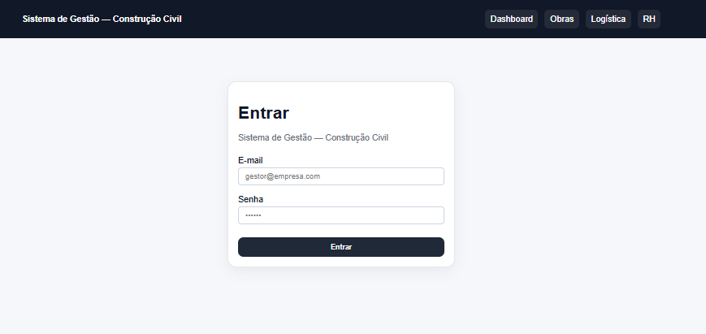
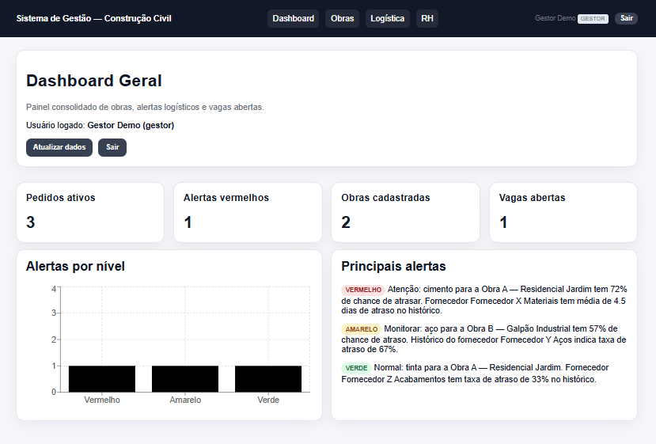
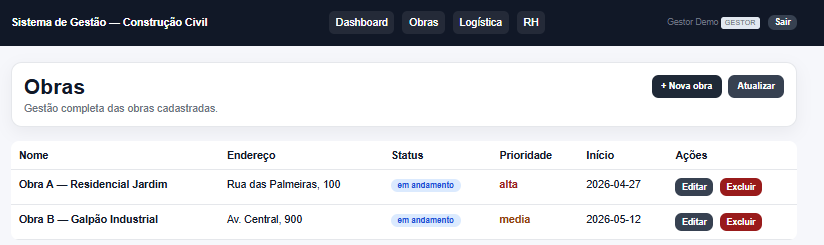
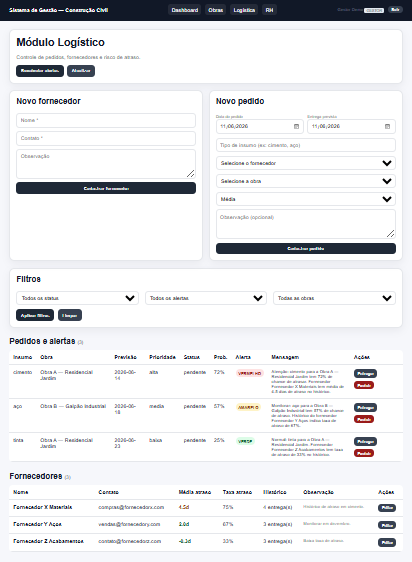
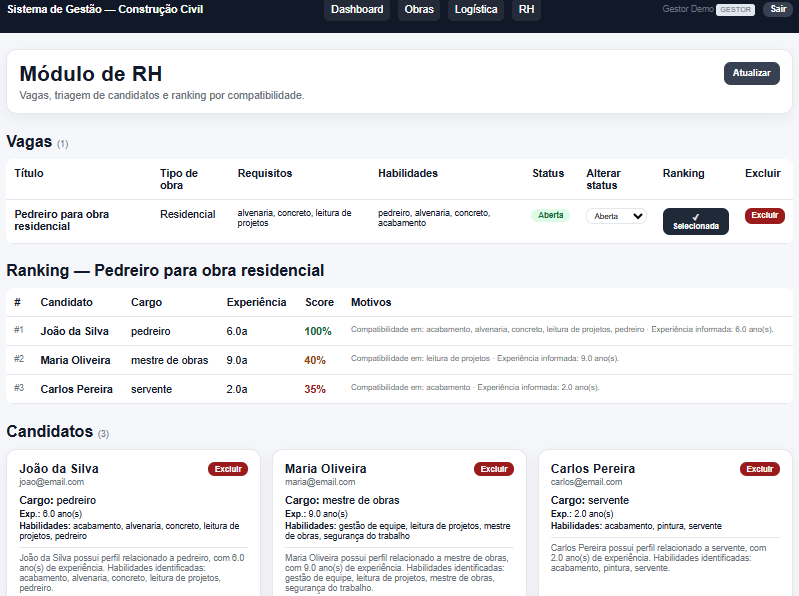

# Sistema de Gestão — Construção Civil

Sistema modular para gestão na construção civil, com foco em **obras**, **logística de materiais com previsão de risco de atraso** e **triagem de candidatos com NLP**. Desenvolvido como **projeto de extensão universitária** (Análise e Desenvolvimento de Sistemas) para uso por uma empresa real de construção civil.

🔗 **Sistema em produção:** https://sistema-construcao-civil.vercel.app/login

> **Status:** MVP funcional publicado, em fase de correção e refinamento. O banco é populado automaticamente com **dados de demonstração** (seed) no primeiro start.

---

## Índice

- [Visão geral](#visão-geral)
- [Capturas de tela](#capturas-de-tela)
- [Arquitetura](#arquitetura)
- [Stack tecnológica](#stack-tecnológica)
- [Módulos](#módulos)
- [Como o risco de atraso é calculado](#como-o-risco-de-atraso-é-calculado)
- [Estrutura de pastas](#estrutura-de-pastas)
- [Rodando localmente (Docker)](#rodando-localmente-docker)
- [Rodando sem Docker](#rodando-sem-docker)
- [Variáveis de ambiente](#variáveis-de-ambiente)
- [Usuários de demonstração](#usuários-de-demonstração)
- [Documentação da API](#documentação-da-api)
- [Testes](#testes)
- [Deploy em produção](#deploy-em-produção)
- [Controle de acesso (RBAC)](#controle-de-acesso-rbac)

---

## Visão geral

O sistema ataca dois problemas recorrentes em empresas de construção civil:

1. **Atrasos no recebimento de materiais** — através do controle de pedidos, fornecedores, histórico de entregas e geração automática de alertas de risco (vermelho / amarelo / verde) por pedido.
2. **Dificuldade na triagem de mão de obra** — através do cadastro de vagas, processamento de currículos com NLP (spaCy + PyMuPDF), extração de cargo/experiência/habilidades e ranking de compatibilidade candidato × vaga.

Tudo é organizado sobre uma base administrativa (**Core**) com autenticação JWT e controle de acesso por perfil.

---

## Capturas de tela

> As imagens ficam em `docs/screenshots/`. Coloque os arquivos `.png` nessa pasta com os nomes abaixo.

### Login


### Dashboard geral
Painel consolidado com pedidos ativos, alertas vermelhos, obras cadastradas, vagas abertas, gráfico de alertas por nível e principais alertas.


### Obras
Listagem e gestão completa (criar, editar, excluir) das obras.


### Módulo Logístico
Cadastro de fornecedores e pedidos, filtros, tabela de pedidos com probabilidade e nível de alerta, e estatísticas calculadas por fornecedor.


### Módulo de RH
Vagas, ranking de candidatos por compatibilidade e cards de candidatos com resumo gerado automaticamente.


---

## Arquitetura

```
┌──────────────────────────┐         ┌──────────────────────────────┐
│   Frontend (Next.js 16)  │  HTTPS  │   Backend (FastAPI / Python) │
│   React 19 + TypeScript  │ ──────► │   API REST + JWT + RBAC       │
│   Recharts • proxy.ts     │         │   Core • Logística • RH       │
└──────────────────────────┘         │   Notificações • ML • NLP     │
        Vercel                        └───────────────┬──────────────┘
                                                      │ SQLAlchemy 2.0
                                                      ▼
                                       ┌──────────────────────────────┐
                                       │   PostgreSQL (Neon)           │
                                       │   migrações via Alembic       │
                                       └──────────────────────────────┘
```

- **API REST central** (FastAPI) consumida pelo frontend e pelos módulos internos.
- **Modelos e schemas modularizados** por domínio (`core` / `logistico` / `rh`), reexportados por pacotes `__init__.py` para manter os imports estáveis.
- **APScheduler** executa um job diário (07h, America/Sao_Paulo) que recalcula as estatísticas dos fornecedores e os alertas dos pedidos pendentes.
- **Configuração centralizada** via `pydantic-settings` (`app/config.py`), que **recusa subir em produção** com configurações inseguras (ex.: `JWT_SECRET` padrão ou `DATABASE_URL` apontando para localhost).

---

## Stack tecnológica

### Backend
| Camada | Ferramenta |
| --- | --- |
| Linguagem | Python 3.11 |
| API | FastAPI 0.115 + Uvicorn |
| ORM / Migrações | SQLAlchemy 2.0 + Alembic |
| Banco | PostgreSQL (Neon em produção) |
| Validação / Config | Pydantic 2 + pydantic-settings |
| Autenticação | JWT (`python-jose`) + hashing **PBKDF2-SHA256** (sem dependência de bcrypt) |
| Ciência de dados | Pandas (agregação do histórico) |
| ML | scikit-learn *(dependência reservada para evolução do modelo)* |
| NLP | spaCy `pt_core_news_sm` + PyMuPDF |
| Agendamento | APScheduler |
| Testes | Pytest + httpx |

### Frontend
| Camada | Ferramenta |
| --- | --- |
| Framework | Next.js 16 (App Router) |
| UI | React 19 + TypeScript |
| Gráficos | Recharts |
| Estilo | CSS global (`app/globals.css`) |
| Proteção de rotas | `proxy.ts` (convenção do Next.js 16, antiga `middleware.ts`) + `AuthContext` |

### Infraestrutura
- Docker + Docker Compose (ambiente local unificado: db + backend + frontend)
- Neon (PostgreSQL gerenciado), Render (backend Docker), Vercel (frontend)

---

## Módulos

### Core — Gestão
- Cadastro de **usuários** com perfis (gestor, operador, RH) e soft-delete (desativação).
- Cadastro e gestão de **obras** (CRUD completo, com guarda de integridade na exclusão).
- Autenticação JWT e controle de acesso por perfil.

### Logístico — Dados + Risco de atraso
- **Fornecedores** com estatísticas calculadas automaticamente (média de atraso, desvio padrão, taxa de atraso, total de entregas).
- **Pedidos** de materiais (data do pedido, entrega prevista, entrega real, insumo, fornecedor, obra, prioridade, observação).
- **Histórico de entregas** por fornecedor/insumo, com mês de referência (sazonalidade).
- Cálculo de **probabilidade de atraso** e classificação em **vermelho / amarelo / verde**, exibidos no dashboard.
- Registro de entrega que fecha o ciclo de vida do pedido e dispara o recálculo.

### RH — NLP + Triagem
- Cadastro de **vagas** com requisitos e habilidades, e ciclo de vida (aberta / pausada / encerrada).
- Cadastro de **candidatos** e **upload de currículo em PDF** (extração de texto com PyMuPDF).
- Extração de **cargo, experiência e habilidades** com spaCy (com *fallback* transparente para regex caso o modelo não esteja disponível).
- **Resumo automático** local do candidato e **ranking de compatibilidade** por vaga.

### Notificações
- Montagem de e-mails de alerta para pedidos em risco (vermelho/amarelo).
- Envio real por **SMTP** quando configurado; caso contrário, opera em **modo simulado**.

---

## Como o risco de atraso é calculado

O risco **não** vem de um modelo de ML treinado (ainda). Hoje é uma **heurística ponderada** (`app/services/logistico_ml.py`), interpretável e fácil de ajustar:

| Componente | Peso | Significado |
| --- | --- | --- |
| Taxa de atraso histórica do fornecedor | 0,45 | indicador mais confiável |
| Média de atraso (normalizada via log) | 0,25 | magnitude típica do atraso |
| Desvio padrão do atraso | 0,10 | imprevisibilidade do fornecedor |
| Risco de prazo (dias até a entrega) | 0,20 | urgência |

A **prioridade do pedido** não entra no cálculo da probabilidade — ela só **amplifica o nível de alerta** na classificação final:

- 🔴 **Vermelho:** prob. ≥ 85% (qualquer prioridade) **ou** prob. ≥ 65% com prioridade alta
- 🟡 **Amarelo:** 40%–64% com prioridade média ou alta
- 🟢 **Verde:** demais casos

> Os limiares são configuráveis e devem ser validados com os dados reais da empresa. O `scikit-learn` já está na stack para, futuramente, substituir a heurística por um modelo treinado com o histórico rotulado (atrasou / não atrasou).

---

## Estrutura de pastas

```
sistema_construcao_civil/
├── backend/
│   ├── app/
│   │   ├── main.py              # app FastAPI, CORS, lifespan, /health
│   │   ├── config.py           # pydantic-settings (fonte única de config)
│   │   ├── database.py         # engine, sessão, Base
│   │   ├── auth.py             # JWT, hashing PBKDF2, RBAC
│   │   ├── jobs.py             # APScheduler (recálculo diário)
│   │   ├── seed.py             # dados de demonstração (idempotente)
│   │   ├── models/             # core.py / logistico.py / rh.py
│   │   ├── schemas/            # core.py / logistico.py / rh.py / auth.py / notificacoes.py
│   │   ├── routers/            # auth / core / logistico / rh / notificacoes
│   │   └── services/           # logistico_ml.py / rh_nlp.py / notifications.py
│   ├── alembic/                # migrações
│   ├── tests/                  # pytest (integração + unidade, base SQLite)
│   ├── Dockerfile
│   ├── requirements.txt
│   └── start.sh                # alembic upgrade + uvicorn
├── frontend/
│   ├── app/                    # login / page (dashboard) / obras / logistico / rh
│   ├── components/             # NavHeader / Providers / ProtectedRoute
│   ├── contexts/AuthContext.tsx
│   ├── lib/api.ts              # cliente HTTP autenticado
│   ├── types/index.ts         # tipos compartilhados
│   ├── proxy.ts               # proteção de rotas (Next.js 16)
│   ├── next.config.mjs
│   └── Dockerfile
├── docs/
│   ├── api/                    # export da documentação OpenAPI (PDF)
│   └── screenshots/            # imagens usadas neste README
├── docker-compose.yml
├── render.yaml                 # blueprint de deploy do backend no Render
└── .env.example
```

---

## Rodando localmente (Docker)

Pré-requisitos: Docker Desktop com **≥ 4 GB de RAM** alocados (o build do Next.js 16 com Turbopack consome bastante memória).

```bash
# 1. Copie o exemplo de variáveis e ajuste se necessário
cp .env.example .env

# 2. Suba todo o ambiente (db + backend + frontend)
docker compose up --build
```

Serviços:
- Frontend: http://localhost:3000
- Backend (API + docs): http://localhost:8000/docs
- PostgreSQL: `localhost:5432`

O backend roda `alembic upgrade head` e, em seguida, popula o banco com os **dados de demonstração** automaticamente.

---

## Rodando sem Docker

### Backend
```bash
cd backend
python -m venv .venv && source .venv/bin/activate   # Windows: .venv\Scripts\activate
pip install -r requirements.txt
python -m spacy download pt_core_news_sm             # opcional (há fallback)

# configure DATABASE_URL etc. (via .env na pasta backend)
alembic upgrade head
uvicorn app.main:app --reload
```

### Frontend
```bash
cd frontend
npm install
npm run dev
```

---

## Variáveis de ambiente

| Variável | Onde | Descrição |
| --- | --- | --- |
| `DATABASE_URL` | backend | URL do PostgreSQL (ex.: Neon) |
| `JWT_SECRET` | backend | **≥ 32 caracteres** em produção (obrigatório) |
| `ACCESS_TOKEN_EXPIRE_MINUTES` | backend | expiração do token (padrão 480 = 8h) |
| `ENVIRONMENT` | backend | `development` / `production` / `test` |
| `FRONTEND_URL` | backend | origem do frontend para o CORS (**sem barra final**) |
| `NEXT_PUBLIC_API_URL` | frontend | URL do backend (**sem barra final**) |
| `SMTP_*` | backend | opcional — habilita envio real de e-mails |
| `OPENAI_API_KEY` / `ANTHROPIC_API_KEY` | backend | opcional — resumo via LLM (reservado) |

> Em produção, `app/config.py` **interrompe a inicialização** se `JWT_SECRET` for inseguro/curto ou se `DATABASE_URL` apontar para localhost. Isso é proposital.

---

## Usuários de demonstração

Criados automaticamente pelo seed (senha `123456`):

| Perfil | E-mail | Senha |
| --- | --- | --- |
| Gestor | `gestor@empresa.com` | `123456` |
| Operador | `operador@empresa.com` | `123456` |
| RH | `rh@empresa.com` | `123456` |

---

## Documentação da API

Com o backend rodando, a documentação interativa é gerada automaticamente pelo FastAPI:

- Swagger UI: `/docs`
- ReDoc: `/redoc`
- Health check: `/health`

Um export em PDF da documentação está disponível em `docs/api/`.

---

## Testes

```bash
cd backend
pytest
```

Os testes usam **SQLite** (arquivo temporário) e sobrescrevem o `DATABASE_URL` antes de qualquer import do app, portanto **não tocam no banco real**. Cobrem login/RBAC, CRUD de obras/fornecedores/pedidos, validações, ordenação de alertas por severidade, dashboard, vagas, candidatos, ranking e filtros de pedidos.

---

## Deploy em produção

| Camada | Plataforma |
| --- | --- |
| Banco | Neon (PostgreSQL) |
| Backend | Render (Docker — `render.yaml`) |
| Frontend | Vercel (Next.js) |

Pontos de atenção:
- No **Render**, defina `DATABASE_URL` (Neon) e `FRONTEND_URL` (URL do Vercel, sem barra final). `JWT_SECRET` é gerado automaticamente pelo blueprint.
- No **Vercel**, defina `NEXT_PUBLIC_API_URL` apontando para a URL pública do Render (sem barra final).
- No plano gratuito do Render, o serviço hiberna após inatividade — a **primeira** requisição após ocioso pode levar dezenas de segundos.

---

## Controle de acesso (RBAC)

| Ação | Gestor | Operador | RH |
| --- | :---: | :---: | :---: |
| Ver dashboard / obras / pedidos | ✅ | ✅ | ✅ |
| Gerenciar usuários | ✅ | — | — |
| Criar/editar obras | ✅ | ✅ | — |
| Excluir obras | ✅ | — | — |
| Gerenciar fornecedores/pedidos | ✅ | ✅ | — |
| Gerenciar vagas/candidatos | ✅ | — | ✅ |

---

*Projeto de extensão universitária — Análise e Desenvolvimento de Sistemas.*
